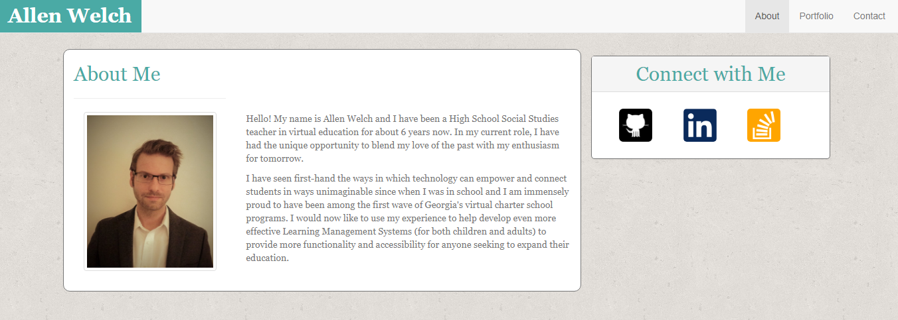

# Bootstrap-Portfolio
wk2 HW Assignment 1
https://allenjwelch.github.io/Bootstrap-Portfolio/

Basic Portfolio with Bootstrap/CSS for added responsiveness. 
<!--On xs and sm screens, each section should take up the entire grid. On m and larger screens, each section should take up 2/3 of the grid and the sidebar should take up 1/3 of the grid-->
